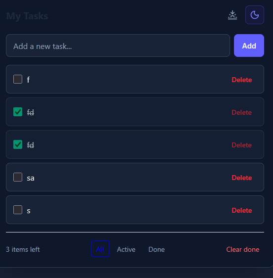

## Advanced To-Do App

A modern and responsive To-Do application built with Next.js, TypeScript, Tailwind CSS, and next-themes.

This app helps users manage daily tasks efficiently with support for task editing, filtering, theme switching, and persistent storage using Local Storage.

## Features
* Add new tasks
* Edit tasks (Double-click to edit)
* Mark tasks as completed
* Delete tasks
* Filter tasks (All, Active, Done)
* Clear completed tasks
* Dark Mode
* Light Mode
* Local Storage support
* Responsive Design

## Screenshot

#How to Use

## Add a Task

Enter a task in the input field and click Add.

## Complete a Task

Click the checkbox beside a task.

## Edit a Task

Double-click any task to edit it.

## Delete a Task

Click the Delete button.

# Filter Tasks

Use the filter buttons:

* All
* Active
* Done
# Clear Completed Tasks

Remove all completed tasks with a single click.

# Switch Theme
* Sunset Icon → Light Mode
* Moon Icon → Dark Mode
# Data Persistence

Tasks are automatically saved in the browser using Local Storage.

Your tasks remain available even after refreshing the page.

# Tech Stack
* Next.js
* React
* TypeScript
* Tailwind CSS
* next-themes
* Lucide React

# Author

Created by Sana Chishtti

